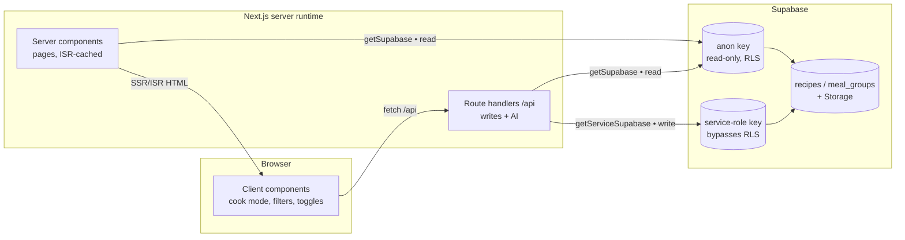

# Architecture

A short map of how Creaciones Colibrí is put together — the rendering model, how data flows on reads vs. writes, the taxonomy/region rules, and the write-auth model. For setup and env vars see [README.md](README.md) and [DEPLOY.md](DEPLOY.md).

## Rendering model

Next.js App Router. Pages are **server components** that fetch from Supabase at request/build time and are **ISR-cached** (`revalidate = 3600`), so browse/detail pages serve from cache and refresh hourly. Interactive pieces (cook mode, servings stepper, unit toggle, favorites, filters) are **client components**. All mutations and AI calls go through **route handlers** under `src/app/api/`.

Every reader-facing route is locale-prefixed (`/en`, `/es`) via the `[lang]` segment.

## Data flow

**Read path.** Server components call helpers in `src/lib/recipes.ts` (e.g. `getRecipeById`, `getRecipeCards`, `getRecipeCardsFiltered`) which use the **anon** client (`getSupabase()`). The `recipes` table is RLS-locked to read-only for anon, so a leaked anon key can't write. List queries select a narrow `CARD_FIELDS` projection rather than `*`.

**Write path.** Only route handlers write, and only through `getServiceSupabase()` — a **server-only** client using `SUPABASE_SERVICE_ROLE_KEY` that bypasses RLS. That key never enters the browser bundle. Every write handler is gated (see [Auth & writes](#auth--writes)).

## Search

Keyword search resolves to a single Postgres RPC, `search_recipes(q)`, called from both `src/lib/recipes.ts` and `/api/recipes`. Under the hood it uses **full-text search** (English + Spanish configs) with `ts_rank` ordering, a `pg_trgm` similarity fallback for typos, and `unaccent` so "platano" matches "plátano". Ordering from the SQL function flows through PostgREST to the UI.

Search is **keyword-only by design** — no embeddings / semantic search. At this collection size FTS + trigram is the right tool and adds no infrastructure beyond the Postgres already in use.

## Taxonomy & region rules

`src/lib/taxonomy.ts` is the single source of truth for the controlled vocabulary:

- **Category** — a fixed 12-value enum (`Mains`, `Sides`, `Soups`, `Salads`, `Breakfast`, `Desserts`, `Drinks`, `Sauces`, `Preserves`, `Snacks`, `Appetizers`, `Breads`), enforced by a DB `check` constraint.
- **Difficulty** — `easy` / `medium` / `hard`.
- **Dietary** — a flag array (`vegetarian`, `vegan`, `gluten-free`, `dairy-free`, `pescatarian`, `keto`).
- **Region** — free text, but **never finer than a country**. "Costa Rica" is a *region*; "Costa Rican" (including "Costa Rican (Caribbean)") stays a *cuisine*. `SUGGESTED_REGIONS` seeds the admin datalist and the Spanish label map.

The `derive*` helpers (`deriveCategory`, `deriveRegion`, `deriveDietary`, `deriveDifficulty`) infer structured fields from a recipe's tags/cuisine/steps, and `buildTaxonomyPatch` assembles the column updates — used by import and the `/api/admin/backfill-taxonomy` maintenance route. Spanish labels for every vocabulary term live alongside the vocab as lowercased-key maps.

## Auth & writes

The `recipes` table is RLS-locked; reads are public (anon), writes require the service-role client **and** pass the app-level gate in `src/lib/adminAuth.ts`:

- `writeAllowed(req)` permits a write when either an httpOnly **session cookie** (set by `POST /api/auth/login`) or an `Authorization: Bearer <ADMIN_PASSWORD>` header is present.
- **Default-deny in production:** if `ADMIN_PASSWORD` is unset, writes are denied on a real prod deploy (`VERCEL_ENV === 'production'`) but stay open in dev/preview so local work isn't blocked. `src/lib/runtime.ts` draws that prod/preview distinction (Vercel sets `NODE_ENV=production` for previews too, so `VERCEL_ENV` is the reliable signal).
- The session cookie is a signed token (`src/lib/adminSession.ts`), httpOnly so client JS can't read it — replacing an earlier scheme that mirrored the password into localStorage.

Supporting guards on the same routes: **rate limiting** (`src/lib/rateLimit.ts` — Upstash Redis when configured, in-memory fallback otherwise), an **SSRF guard** on URL import (`src/lib/ssrf.ts`), request-body validation with Zod (`src/lib/schemas.ts`, `src/lib/requestBody.ts`), and a **CORS** lock to the site origin (`src/lib/cors.ts`).

## Internationalization

UI strings live in one dictionary (`src/lib/i18n.ts`) keyed by a `TranslationKey` union, with `en` and `es` tables kept in lockstep (a coverage test guards against drift). Recipe *content* is bilingual per-row (`title` / `title_es`, `tags` / `tags_es`, translated steps/ingredients); a recipe missing Spanish can be translated on demand via `/api/translate`.

## Client-side layer

- **Personal features** are per-device via `localStorage` hooks (`useFavorites`, `useRecentlyViewed`, `useCookNotes`, `useUnitSystem`, plus ingredient check-off), synced across components/tabs with custom events. No account required.
- **PWA** — `src/app/manifest.json` + a hand-authored service worker (`public/sw.js`) with an offline fallback (`public/offline.html`). Cook mode holds a **screen wake lock** (`useWakeLock`).
- **Images** — stored in Supabase Storage; `sharp` + `thumbhash` produce a `blurDataURL` from the `image_thumbhash` column so cards paint a blur placeholder with no layout shift.

## Where things live

| Concern | Location |
|---|---|
| Pages (per locale) | `src/app/[lang]/…` |
| API route handlers | `src/app/api/…` |
| Data access | `src/lib/recipes.ts`, `src/lib/supabase.ts` |
| Taxonomy / vocab | `src/lib/taxonomy.ts` |
| Browse/filter/sort | `src/lib/browse.ts` |
| Quantities / units / time | `src/lib/scale.ts`, `src/lib/convert.ts`, `src/lib/time.ts` |
| Auth / safety | `src/lib/adminAuth.ts`, `src/lib/adminSession.ts`, `src/lib/rateLimit.ts`, `src/lib/ssrf.ts`, `src/lib/cors.ts`, `src/lib/schemas.ts` |
| i18n | `src/lib/i18n.ts` |
| Client hooks | `src/lib/use*.ts` |
| DB schema | `supabase/migrations/` |
